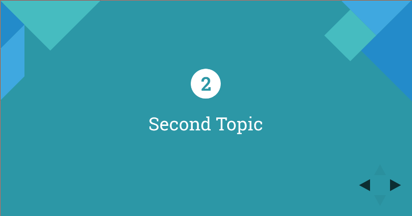

# Puzzle ITC Revealjs Theme


Revealjs Dokumentation: https://github.com/hakimel/reveal.js

## Usage with reveal-md
### Global
1. Install reveal-md: `sudo npm install -g reveal-md`
2. Open the presentation:

    ```reveal-md demo.md --theme https://rawgit.com/puzzle/pitc-revealjs-theme/master/theme/puzzle.css```

Optional: Add an alias in your `.bashrc`:
```
alias reveal-md='reveal-md --theme https://rawgit.com/puzzle/pitc-revealjs-theme/master/theme/puzzle.css'
```

### Local (per project)
1. Install reveal-md: `npm install --save reveal-md`
2. Add script in your `packages.json`:

    ```
    ...
    "scripts": {
        "test": "echo \"Error: no test specified\" && exit 1",
        "reveal-md": "reveal-md demo.md --theme https://rawgit.com/puzzle/pitc-revealjs-theme/master/theme/puzzle.css"
    },
    ...
    ```
3. Open the presentation: `npm run reveal-md`


You may also use `--theme puzzle` if you copy the theme directory into your project. More information at: https://github.com/webpro/reveal-md

## Styles
There are multiple styles that you can use:
* master01: dark blue
* master02: blue
* master03: light blue
* master04: turquoise
* master05: green

Just add this tag under your slides:
```
<!-- .slide: class="master01" -->
```

### Intro Slides
The intro class will turn h1 into a white circle.
```
# 2
## Second Topic
<!-- .slide: class="master04 intro" -->
```


## Installation (more flexibility)
1. Download the latest version of reveal.js from https://github.com/hakimel/reveal.js/releases
2. Unzip and copy `puzzle.css` into `css/theme`
3. Update the included theme in `index.html`
4. Open `index.html` in a browser to view it

## Contributing
1. Follow the "Full setup" instructions on https://github.com/hakimel/reveal.js#full-setup
2. Copy or edit `puzzle.scss` in `css/theme/source`
3. Run `grunt css-themes` to generate the css
