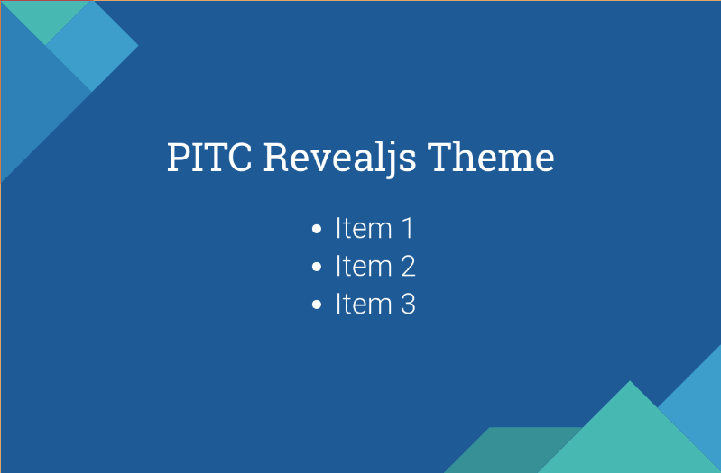

# Puzzle ITC Revealjs Theme



Revealjs Dokumentation: https://github.com/hakimel/reveal.js

## Usage with reveal-md
1. Install reveal-md: `sudo npm install -g reveal-md`
2. Open the presentation: `reveal-md demo.md --theme puzzle`

More information at: https://github.com/webpro/reveal-md

## Styles
There are multiple styles that you can use:
* master01: dark blue
* master02: blue
* master03: light blue
* master04: turquoise
* master05: green

Just add this tag under your slides:
```
<!-- .slide: class="master01" -->
```

## Installation (more flexibility)
1. Download the latest version of reveal.js from https://github.com/hakimel/reveal.js/releases
2. Unzip and copy `puzzle.css` into `css/theme`
3. Update the included theme in `index.html`
4. Open `index.html` in a browser to view it

## Contributing
1. Follow the "Full setup" instructions on https://github.com/hakimel/reveal.js#full-setup
2. Copy or edit `puzzle.scss` in `css/theme/source`
3. Run `grunt css-themes` to generate the css
