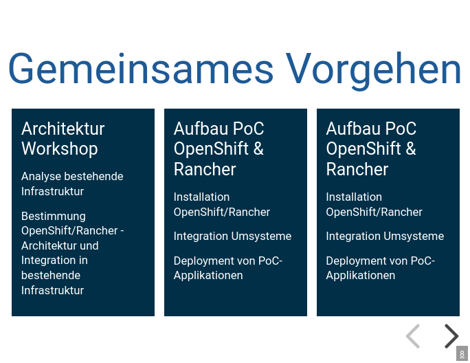

# Puzzle ITC Revealjs Theme


Revealjs Dokumentation: https://github.com/hakimel/reveal.js

## Usage
### Global Installation
1. Install reveal-md: `sudo npm install -g reveal-md`
2. Open the presentation:

    ```reveal-md demo.md --watch --theme https://puzzle.github.io/pitc-revealjs-theme/latest/puzzle.css```

Optional: Add an alias in your `.bashrc`:
```
alias reveal-md='reveal-md --watch --theme https://puzzle.github.io/pitc-revealjs-theme/latest/puzzle.css'
```

### Local (per project)
1. Install reveal-md: `npm install --save reveal-md`
2. Add script in your `packages.json`:

    ```
    ...
    "scripts": {
        "reveal-md": "reveal-md slides.md --watch --theme https://puzzle.github.io/pitc-revealjs-theme/latest/puzzle.css"
    },
    ...
    ```
3. Open the presentation: `npm run reveal-md`

### Versions

The following versions are available:
- `latest`
- Git sha (e.g. `07ff323`)
- Major version (e.g. `1`)
- Minor version (e.g. `1.0`)
- Patch version (e.g. `1.0.0`)

The major version is automatically updated, when there are compatible new features. The minor version is only updated when there are new patches.

See the [gh-pages](https://github.com/puzzle/pitc-revealjs-theme/tree/gh-pages) branch for possible versions.

You can then use the version within the URL:
```
https://puzzle.github.io/pitc-revealjs-theme/${VERSION}/puzzle.css"
```

The releases use Semantic Versioning. More information: http://semver.org/


## Options

There are multiple options to configure a single slide. In the official documentation these are HTML attributes on the section `<section data-XX>`. You may add these in the slide comment:
```
<!-- .slide: data-background-color="aquamarine" -->
```

- [Backgrounds](https://revealjs.com/backgrounds/)
- [Math](https://revealjs.com/math/#markdown)
- [Layout](https://revealjs.com/layout/)
- [Slide Visibility](https://revealjs.com/slide-visibility/)
- [Transitions](https://revealjs.com/transitions/)
- [Advanced: Auto Animate](https://revealjs.com/auto-animate/)
- [Speaker View](https://revealjs.com/speaker-view/)


You may link to a specific slide:
```
<!-- .slide: id="test" -->
# Test

---
# Another slide
[Link](#test)
```

Some features like [Media](https://revealjs.com/media/) also require HTML instead of Markdown:

```
<video data-autoplay src="http://clips.vorwaerts-gmbh.de/big_buck_bunny.mp4"></video>
```

## Fragments
[Fragments](https://revealjs.com/fragments/) can be used in Markdown with the following:
```
- Item 1 <!-- .element: class="fragment" data-fragment-index="2" -->
- Item 2 <!-- .element: class="fragment" data-fragment-index="1" -->
```

## Code Highlighting

Specific parts of code can be highlighted:
````
```js [1-2|3|4]
    let a = 1;
    let b = 2;
    let c = x => 1 + 2 + x;
    c(3);
```
````
See the [official documentation](https://revealjs.com/code/#line-numbers-%26-highlights) for more information.


## Styles

There are multiple styles that you can use:
* master-cover
* master-agenda
* master-people
* master-title
* master-top-head
* master-icons
* master-cards

Just add this tag under the slide seperator:
```
---
<!-- .slide: class="master-cover" -->
```

### master-cover

```md
<!-- .slide: class="master-cover" -->

# Präsentation
# *Puzzle ITC*
### Thema <!-- .element: class="r-stretch" -->
#### John Doe
#### john@mail.com
```

### master-agenda

```md
<!-- .slide: class="master-agenda" -->

## 18.02.2020
# Agenda

- Vorstellungsrunde
- Wer ist Puzzle und was tut Puzzle?
- Referenzen/Kundenprojekte (Success Stories)
- Mögliche Dienstleistungen
- Fragerunde

```

### master-people

```md
<!-- .slide: class="master-people" -->

# Nice to meet you

- 
  ### John Doe
  Head of Business<br>
  Division Z&uuml;rich

  john@email.com

- 
  ### Jane Roe
  Chief Communications,<br>
  Marketing & Sales

  jane@email.com

```

Notice that line breaks must either be created with `<br>` or an empty line.

### master-title

```md
<!-- .slide: class="master-title" -->

## Unsere Firma

# Wer ist Puzzle?
# *Was tut* Puzzle?

```

### master-top-head

```md
<!-- .slide: class="master-top-head" data-background-image="https://www.puzzle.ch/wp-content/uploads/2023/08/pic_puzzle_team_2023_startseite_2000px.jpg" -->

# One Team
```

### master-icons

```md
<!-- .slide: class="master-icons" -->

# Facts & Figures

- 
  - # 23 Jahre
    Gründung GmbH am 9.9.1999

- 
  - # 100%
    Inhabergeführt,
    eigenfinanziert

- 
  - # 100%
    Swiss Made
    Software

- 
  - # beyond
    Nachhaltigkeit,
    Gleichberechtigung,
    Nachwuchsförderung
```
Notice the nested lists `-`!

### master-cards

```md
<!-- .slide: class="master-cards" -->

# Gemeinsames Vorgehen

- # Architektur Workshop
  Analyse bestehende
  Infrastruktur

  Bestimmung
  OpenShift/Rancher -
  Architektur und Integration
  in bestehende Infrastruktur

- # Aufbau PoC OpenShift & Rancher
  Installation
  OpenShift/Rancher

  Integration Umsysteme

  Deployment von PoC-
  Applikationen

- # Aufbau PoC OpenShift & Rancher
  Installation
  OpenShift/Rancher

  Integration Umsysteme

  Deployment von PoC-
  Applikationen

```

### Numbers
To add an incrementing number above a header use:
```
<div class="nr"></div>

# Some Title
```

## Contributing
1. Run `npm install`
2. Run `npm run start`
3. Edit `puzzle.scss` in `css/theme/source`
4. Reload browser

To release a new version:
```
git tag 1.2.3
git push --tags
```

Always use the format `major.minor.patch` and follow Semantic Versioning. More information: http://semver.org/

## Alternative Installations

### Offline Theme

To use the theme without internet connectivity you must copy the `theme/puzzle.css` into your project and use `--theme puzzle.css`. More information (PDF and static site generation): https://github.com/webpro/reveal-md

### Full Installation (use this if you don't want to use markdown)
1. Download the latest version of reveal.js from https://github.com/hakimel/reveal.js/releases
2. Unzip and copy `puzzle.css` into `css/theme`
3. Update the included theme in `index.html`
4. Open `index.html` in a browser to view it
